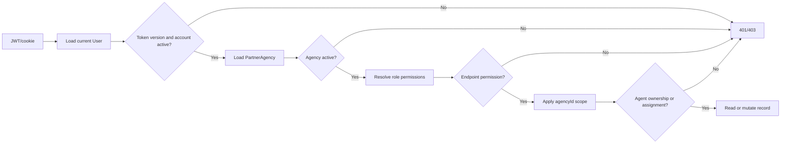
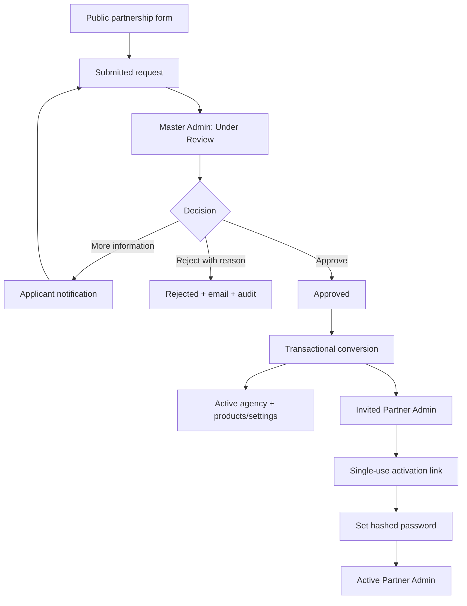
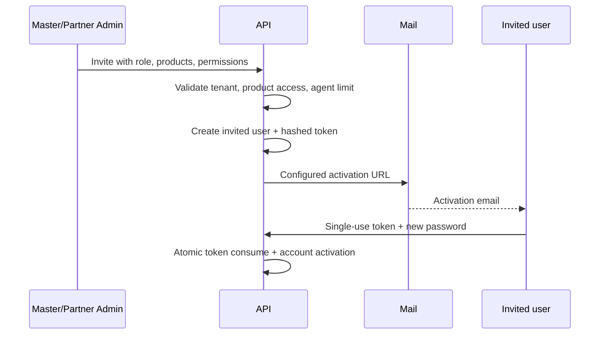
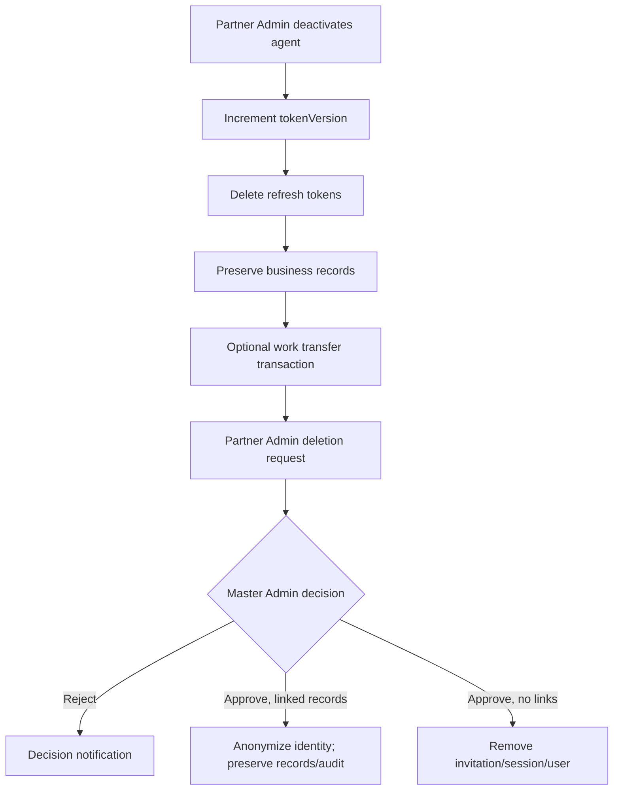

# TravelsTREM multi-tenant agency architecture

## Overview

The existing Express API remains the policy boundary for the Master Admin, Partner Admin, and Partner Agent portals. `agencyId` is the tenant key. Authentication loads the user and agency on every protected request, validates `tokenVersion`, rejects inactive accounts/agencies, and builds an access context from reusable permissions. Controllers derive agency, creator, and owner fields from that context rather than accepting them from an untrusted client.

Primary modules:

- `modules/tenancy`: products, roles, permissions, partnership requests, agencies, invitations, customers, deletion requests, notifications, reports, and audits.
- `modules/auth`: the existing cookie/JWT identity flow, invitation activation, password reset, and session revocation.
- `modules/trevio`, `modules/tours`, and `modules/bookings`: tenant and owner-scoped business records.
- AdminTREM: platform-level request, agency, deletion, product, and audit operations.
- Partner portal: one role-aware application for Partner Admins and Partner Agents.
- AuthTREM `/partnership`: public agency request form; `/activate?token=...`: invitation activation.

## Roles and default permissions

| Capability                               | Master Admin |                        Partner Admin |                     Partner Agent |
| ---------------------------------------- | -----------: | -----------------------------------: | --------------------------------: |
| Partnership review and agency conversion |          Yes |                                   No |                                No |
| Manage agency/legal/product settings     | All agencies | Permitted profile fields, own agency |                                No |
| Invite Partner Admins                    |          Yes |                                   No |                                No |
| Invite/manage Partner Agents             | All agencies |                           Own agency |                                No |
| Permanently approve agent deletion       |          Yes |                         Request only |                                No |
| Trips                                    |          All |                    All in own agency |                          Own only |
| Publish trips                            |          Yes |                                  Yes |   Only when agency policy permits |
| Bookings                                 |          All |                    All in own agency |                     Assigned only |
| Customers                                |          All |                    All in own agency | Owned, or shared by agency policy |
| Reports/audit                            |     Platform |                           Own agency |                     No by default |

The canonical permission keys and mappings live in `permissions.js`. Per-user grants and denials support future Finance, Operations, Sales, and Support roles without adding insecure UI-only role checks.

## Tenant authorization



Partner users never receive a platform-wide query. Partner Admin route parameters are ignored in favor of their session agency. Partner Agents receive an additional `ownerAgent` or `assignedAgent` constraint. File metadata is omitted from public partnership responses; protected document access is audited.

## Partnership and agency activation



Conversion uses a MongoDB transaction. The request can be converted once. Product keys must exist and be active. Invitation tokens are cryptographically random, stored only as SHA-256 hashes, single-use, and expire after `INVITATION_TTL_HOURS`.

## User invitations



Public agent self-registration is disabled. Login email, role, agency, identifiers, and protected audit fields cannot be changed through agent update APIs. Resending an invitation revokes all older unused tokens.

## Deactivation and deletion



Trips, tours, bookings, and customers are checked before physical user removal. Financial and audit records are never cascaded. Trips are archived/cancelled instead of hard-deleted.

## Ownership rules

- Trevio/Trevista trips store `agencyId`, `productKey`, `createdBy`, `ownerAgent`, visibility/publishing status, and archive timestamps.
- Partner Agents can mutate only their own trips. Partner Admins can reassign only to active agents in the same agency.
- Bookings store agency/product/trip/customer/creator/assigned-agent references plus immutable agency and agent snapshots.
- Partner Agents can access only explicitly assigned bookings. Partner Admins receive agency-scoped bookings.
- Customers store agency and owner agent. An agency may opt into shared customer visibility; otherwise agent queries are owner-scoped.

## API summary

Public:

- `POST /api/tenancy/partnership-requests`
- `GET /api/tenancy/products`
- `POST /api/tenancy/invitations/activate`

Master Admin:

- `GET/PATCH/POST /api/tenancy/partnership-requests/...`
- `GET/PATCH /api/tenancy/agencies/...`
- `POST /api/tenancy/agencies/:agencyId/users/invite`
- `PATCH /api/tenancy/deletion-requests/:id`
- `GET /api/tenancy/audit-logs`
- `PUT /api/tenancy/products/:key`

Partner Admin (always own agency):

- `GET/PATCH /api/tenancy/agencies/:id`
- `GET/POST /api/tenancy/agencies/:agencyId/users/...`
- `PATCH /api/tenancy/users/:id`
- `POST /api/tenancy/users/:id/deletion-request`
- `POST /api/tenancy/agencies/:agencyId/transfer-work`
- customer CRUD, reports, agency audit, notifications

Trips and bookings keep their existing URLs. Their controllers now enforce the same access context and tenant/owner constraints.

All list endpoints use bounded pagination (`skip`, `limit`, maximum 100); relevant lists support status/search filters.

## Environment

Required existing values remain `MONGO_URI`, JWT secrets, mail SMTP variables, and frontend URLs. Add or confirm:

```env
AUTH_APP_URL=https://auth.example.com
SHELL_URL=https://app.example.com
ADMIN_URL=https://admin.example.com
INVITATION_TTL_HOURS=48
CLOUDINARY_NAME=
CLOUDINARY_KEY=
CLOUDINARY_SECRET=
SMTP_HOST=
SMTP_PORT=587
SMTP_SECURE=false
SMTP_USER=
SMTP_PASS=
SMTP_FROM_NAME=
SMTP_FROM_EMAIL=
```

MongoDB transactions require a replica set (MongoDB Atlas satisfies this). Never commit real credentials.

## Migration and seed

Back up the database, deploy the backward-compatible models, then run:

```bash
npm run migrate:tenancy --workspace=@apps/backend-api
npm run seed:tenancy --workspace=@apps/backend-api
# Optional development-only Trevoka example (requires DEMO_SEED_PASSWORD)
npm run seed:tenancy:demo --workspace=@apps/backend-api
```

Migration attaches existing partner users and their trips/bookings to matching agencies and converts legacy approved agencies to active. It does not delete records. The seed idempotently creates Trevio, Trevista, the three system roles, and their permission mappings.

## Local verification

```bash
npm test --workspace=@apps/backend-api
npm run build --workspace=@apps/backend-api
npm run build --workspace=@apps/admin
npm run build --workspace=@apps/partner
npm run build --workspace=@apps/auth
```

For local email testing, configure a sandbox SMTP account, set `ENABLE_EMAILS=true`, start the backend, and invite a test user. Do not use a personal mailbox password; use a provider app password or sandbox credentials.
